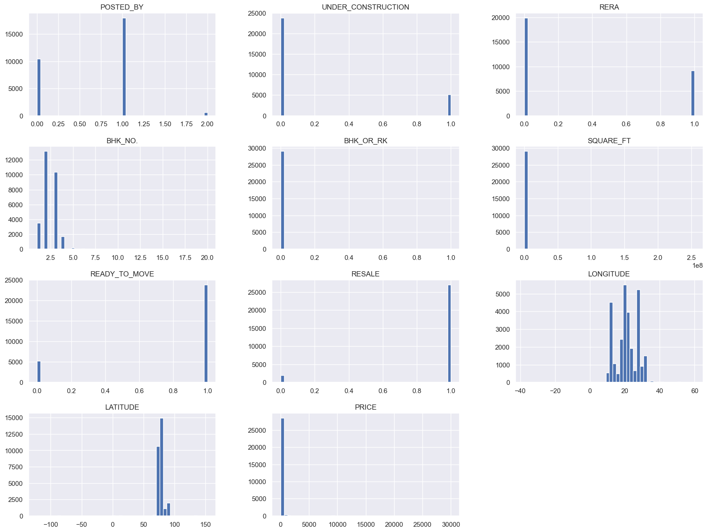
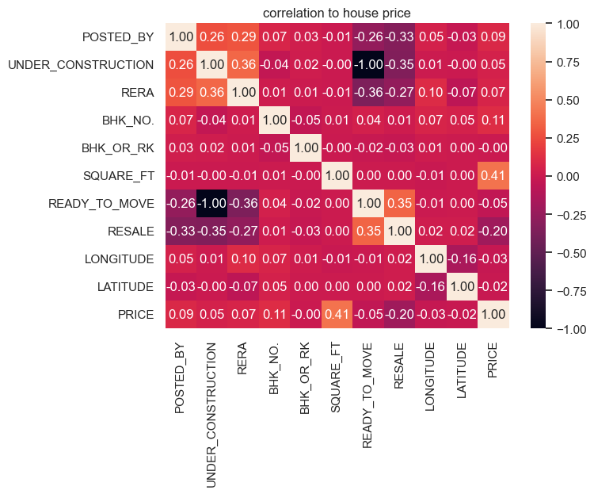
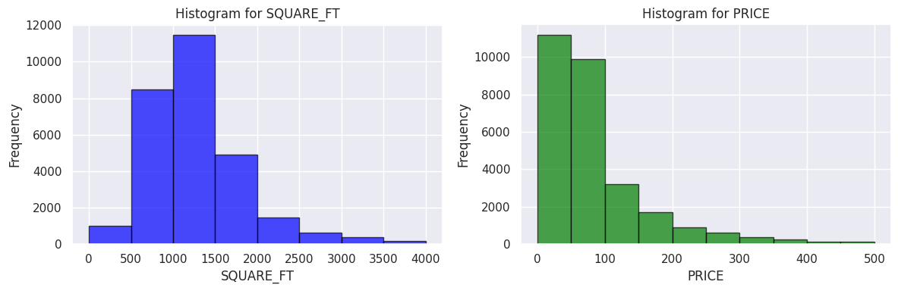
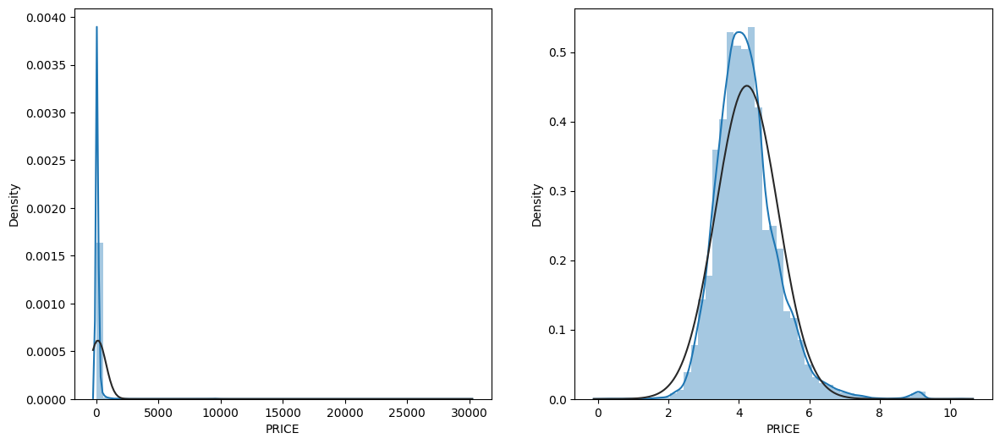
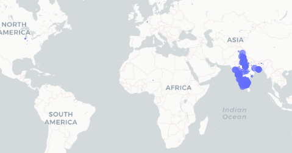
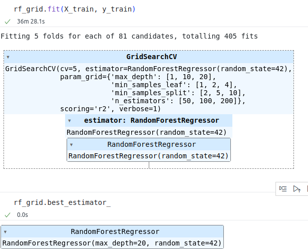

# kaggle-House-Price-Prediction-Challenge

## 데이터 링크
https://www.kaggle.com/datasets/anmolkumar/house-price-prediction-challenge/data

## 데이터 선정 이유
- 집과 관련되어 있는 여러 속성들을 이용해 집값을 예측한다
- 상관관계에 집중하여 여러 속성들을 추출해본다.

## 데이터 설명
- 집과 관련된 데이터
- Target 값인 집값을 제외하고 모두 11 columns 로 이루어져있다.
- train shape: (29451, 12)
- test shape: (68720, 11)

###
|Columns|Description|DataType|
|------|---|---|
|POSTED_BY|부동산을 등록한 사람|Object|
|UNDER_CONSTRUCTION|현재 건설 중인지 여부|Int64|
|RERA|RERA 승인 여부|Int64|
|BHK_NO|방의 수|Int64|
|BHK_OR_RK|부동산 유형|Object|
|SQUARE_FT|집의 총 면적|Float64|
|READY_TO_MOVE|이동 준비 여부|Int64|
|RESALE|재판매 여부|Int64|
|ADDRESS|집의 주소|Object|
|LONGITUDE|집의 경도|Float64|
|LATITUDE|집의 위도|Float64|
|TARGET(PRICE_IN_LACS)|집의 가격|Float64

## EDA
- 중복데이터 제거 (401 rows duplicated)
- column name 변경
  - TARGET(PRICE_IN_LACS) -> PRICE
- POSTED_BY
  - Owner: 0, Dealer: 1, Builder: 2
- BHK_OR_RK
  - BHK: 0, RK: 1

## 시각화 분석
- 전체적인 데이터 불균형

- Address 제외한 데이터들의 상관관계 분석
  - Price 와 Square 의 상관관계가 가장 높게 나타남 (0.41)

- Price 와 Square 데이터의 분포도 확인
  - 평수는 정규분포와 비슷한 형태를 띄우지만 Price 의 경우 한쪽으로 치우친 결과

  - Prices: np.log

- 위경도가 잘못 들어간 것으로 추측되는 데이터들이 존재함

## GridSearchCV 결과
- best score: 0.8984

### GridSearchCV w/encoded CITY_NAME
- best score: 0.9047

## XGBoost 결과
Root Mean Squared Error (RMSE): 159.47987438645427

## 결론
- RandomForestRegressor 의 결과,
  - max_depth=10, n_estimators=50, random_state=42 의 경우 가장 좋은 성능을 보였다.
  - best_score_: 0.8984
  - best_score_w_one_hot_city_name: 0.9047
- Xboost 의 결과,
  - rmse: 159.4798

